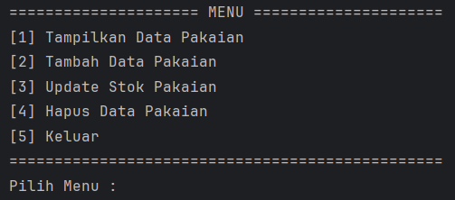
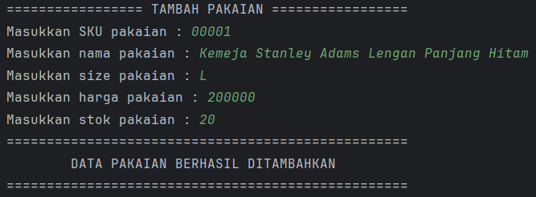
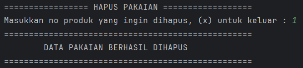

# Aplikasi Manajemen Data Pakaian

Aplikasi berbasis CLI (Command Line Interface) untuk mengelola data produk pakaian, dibangun menggunakan **Java**. Mendukung operasi CRUD: tambah, tampilkan, update stok, dan hapus data pakaian.

---

## 📁 Struktur Proyek

```
src/
└── io/github/mfthfzn/
    ├── Main.java              
    ├── Product.java           
    ├── ProductRepository.java 
    ├── ProductService.java    
    ├── ProductView.java       
    └── Util.java              
```

---

## Arsitektur

Proyek ini mengikuti pola **Layered Architecture** dengan 3 lapisan utama:

| Lapisan      | Kelas                 | Tanggung Jawab                              |
|--------------|-----------------------|---------------------------------------------|
| **View**     | `ProductView`         | Menampilkan menu dan menerima input pengguna |
| **Service**  | `ProductService`      | Validasi data dan logika bisnis             |
| **Repository** | `ProductRepository` | Penyimpanan dan manipulasi data (in-memory) |

---

## Fitur

- **Tampilkan Data Pakaian** — Menampilkan seluruh produk dalam format tabel
- **Tambah Data Pakaian** — Menambahkan produk baru dengan SKU, nama, ukuran, harga, dan stok
- **Update Stok Pakaian** — Memperbarui jumlah stok produk berdasarkan nomor urut
- **Hapus Data Pakaian** — Menghapus produk berdasarkan nomor urut

---

## Penjelasan Kelas

### `Product.java`
Model data yang merepresentasikan satu produk pakaian.

| Field   | Tipe      | Keterangan              |
|---------|-----------|-------------------------|
| `SKU`   | `String`  | Kode unik produk        |
| `name`  | `String`  | Nama pakaian            |
| `size`  | `String`  | Ukuran (S, M, L, XL...) |
| `price` | `Integer` | Harga produk            |
| `stock` | `Integer` | Jumlah stok             |

---

### `ProductRepository.java`
Mengelola penyimpanan data menggunakan `ArrayList` sebagai database in-memory.

| Method              | Keterangan                        |
|---------------------|-----------------------------------|
| `insert(product)`   | Menyimpan produk baru             |
| `getAll()`          | Mengambil semua produk            |
| `get(index)`        | Mengambil produk berdasarkan index |
| `edit(index, product)` | Memperbarui produk di index tertentu |
| `delete(index)`     | Menghapus produk di index tertentu |

---

### `ProductService.java`
Menangani validasi dan logika bisnis sebelum data diteruskan ke repository.

| Method                      | Keterangan                              |
|-----------------------------|-----------------------------------------|
| `addProduct(product)`       | Validasi lalu simpan produk baru        |
| `showProducts()`            | Tampilkan semua produk dalam format tabel |
| `checkProduct(index)`       | Validasi keberadaan produk di index     |
| `editProduct(index, stock)` | Perbarui stok produk                   |
| `removeProduct(index)`      | Hapus produk berdasarkan index          |

---

### `ProductView.java`
Menangani seluruh interaksi dengan pengguna melalui terminal.

| Method               | Keterangan                        |
|----------------------|-----------------------------------|
| `mainView()`         | Menampilkan menu utama            |
| `addProductView()`   | Form tambah produk baru           |
| `showProductView()`  | Menampilkan tabel daftar produk   |
| `updateStockView()`  | Form update stok produk           |
| `deleteProductView()`| Form hapus produk                 |

---

## Screenshots Tampilan

### Menu Utama


---

### 1. Tampilkan Data Pakaian


---

### 2. Tambah Data Pakaian


---

### 3. Update Stok Pakaian


---

### 4. Hapus Data Pakaian


---