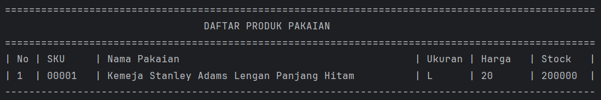
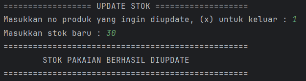

# Aplikasi Manajemen Data Pakaian

Aplikasi berbasis CLI (Command Line Interface) untuk mengelola data produk pakaian, dibangun menggunakan **Java**. Dilengkapi sistem autentikasi login dan mendukung operasi CRUD: tambah, tampilkan, update stok, dan hapus data pakaian.

---

## 📁 Struktur Proyek

```
├── assets/
└── src/
    └── io/github/mfthfzn/
        ├── Main.java
        ├── entity/
        │   ├── User.java
        │   └── Product.java
        ├── repository/
        │   ├── UserRepository.java
        │   └── ProductRepository.java
        ├── service/
        │   ├── LoginService.java
        │   └── ProductService.java
        ├── view/
        │   ├── LoginView.java
        │   └── ProductView.java
        └── util/
            └── ScannerUtil.java
```

---

## Arsitektur

Proyek ini mengikuti pola **Layered Architecture** dengan 3 lapisan utama:

| Lapisan        | Kelas                                   | Tanggung Jawab                               |
|----------------|-----------------------------------------|----------------------------------------------|
| **View**       | `LoginView`, `ProductView`              | Menampilkan menu dan menerima input pengguna |
| **Service**    | `LoginService`, `ProductService`        | Validasi data dan logika bisnis              |
| **Repository** | `UserRepository`, `ProductRepository`  | Penyimpanan dan manipulasi data (in-memory)  |

---

## Fitur

- **Login** — Autentikasi pengguna sebelum mengakses menu produk
- **Tampilkan Data Pakaian** — Menampilkan seluruh produk dalam format tabel
- **Tambah Data Pakaian** — Menambahkan produk baru dengan SKU, nama, ukuran, harga, dan stok
- **Update Stok Pakaian** — Memperbarui jumlah stok produk berdasarkan nomor urut
- **Hapus Data Pakaian** — Menghapus produk berdasarkan nomor urut

---

## Penjelasan Kelas

### `User.java`
Model data yang merepresentasikan pengguna aplikasi.

| Field      | Tipe     | Keterangan    |
|------------|----------|---------------|
| `username` | `String` | Nama pengguna |
| `password` | `String` | Kata sandi    |

---

### `Product.java`
Model data yang merepresentasikan satu produk pakaian.

| Field   | Tipe      | Keterangan              |
|---------|-----------|-------------------------|
| `SKU`   | `String`  | Kode unik produk        |
| `name`  | `String`  | Nama pakaian            |
| `size`  | `String`  | Ukuran (S, M, L, XL...) |
| `price` | `Integer` | Harga produk            |
| `stock` | `Integer` | Jumlah stok             |

---

### `UserRepository.java`
Mengelola data pengguna secara in-memory. Secara default menyediakan satu user awal.

| Method              | Keterangan                                           |
|---------------------|------------------------------------------------------|
| `getUser(username)` | Mencari dan mengembalikan user berdasarkan username  |

---

### `ProductRepository.java`
Mengelola penyimpanan data produk menggunakan `ArrayList` sebagai database in-memory.

| Method                 | Keterangan                           |
|------------------------|--------------------------------------|
| `insert(product)`      | Menyimpan produk baru                |
| `getAll()`             | Mengambil semua produk               |
| `get(index)`           | Mengambil produk berdasarkan index   |
| `edit(index, product)` | Memperbarui produk di index tertentu |
| `delete(index)`        | Menghapus produk di index tertentu   |

---

### `LoginService.java`
Menangani logika autentikasi pengguna.

| Method                     | Keterangan                                  |
|----------------------------|---------------------------------------------|
| `auth(username, password)` | Memvalidasi username dan password pengguna  |

---

### `ProductService.java`
Menangani validasi dan logika bisnis sebelum data diteruskan ke repository.

| Method                      | Keterangan                                |
|-----------------------------|-------------------------------------------|
| `addProduct(product)`       | Validasi lalu simpan produk baru          |
| `showProducts()`            | Tampilkan semua produk dalam format tabel |
| `checkProduct(index)`       | Validasi keberadaan produk di index       |
| `editProduct(index, stock)` | Perbarui stok produk                      |
| `removeProduct(index)`      | Hapus produk berdasarkan index            |

---

### `LoginView.java`
Menangani tampilan autentikasi pengguna.

| Method        | Keterangan                             |
|---------------|----------------------------------------|
| `mainView()`  | Menampilkan menu utama (Login/Keluar)  |
| `loginView()` | Form input username dan password       |

---

### `ProductView.java`
Menangani seluruh interaksi pengelolaan produk melalui terminal.

| Method                | Keterangan                      |
|-----------------------|---------------------------------|
| `mainView()`          | Menampilkan menu produk         |
| `addProductView()`    | Form tambah produk baru         |
| `showProductView()`   | Menampilkan tabel daftar produk |
| `updateStockView()`   | Form update stok produk         |
| `deleteProductView()` | Form hapus produk               |

---

## Screenshots Tampilan

> **Catatan:** Letakkan file screenshot Anda di folder `assets/` sesuai nama file di bawah ini.

### Menu Utama


---

### Login


---

### Menu User


---

### 1. Tampilkan Data Pakaian


---

### 2. Tambah Data Pakaian


---

### 3. Update Stok Pakaian


---

### 4. Hapus Data Pakaian


---

## Akun Default

Aplikasi menyediakan satu akun bawaan untuk login:

| Username | Password  |
|----------|-----------|
| `eko`    | `rahasia` |

---
