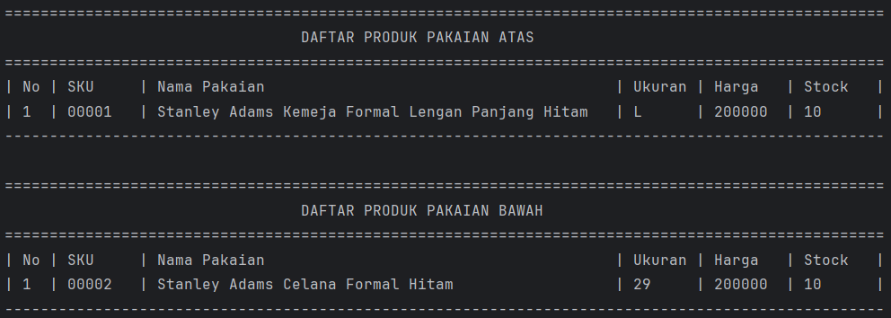
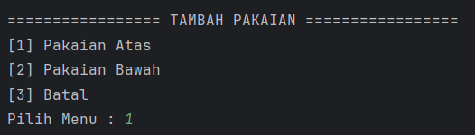
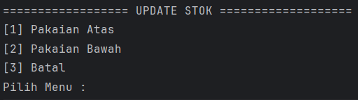
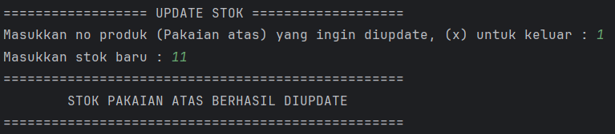
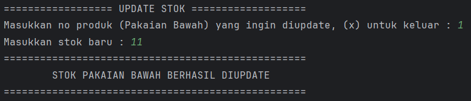
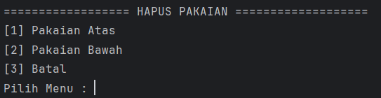
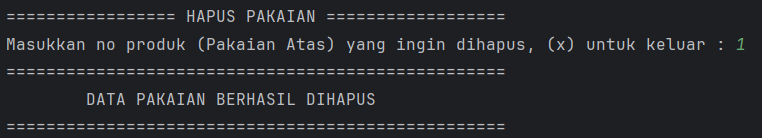
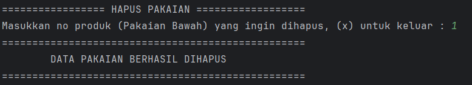

# Aplikasi Manajemen Data Pakaian

Aplikasi berbasis CLI (Command Line Interface) untuk mengelola data produk pakaian, dibangun menggunakan Java. Dilengkapi sistem autentikasi login dan mendukung operasi CRUD: tambah, tampilkan, update stok, dan hapus data pakaian. Menerapkan konsep **Inheritance** dengan `Clothes` sebagai parent class dan `Tops` serta `Bottoms` sebagai subclass.

---

## 📁 Struktur Proyek

```
├── assets/
└── src/
    └── io/github/mfthfzn/
        ├── Main.java
        ├── entity/
        │   ├── User.java
        │   ├── Clothes.java
        │   ├── Tops.java
        │   └── Bottoms.java
        ├── repository/
        │   ├── UserRepository.java
        │   ├── TopsRepository.java
        │   └── BottomsRepository.java
        ├── service/
        │   ├── LoginService.java
        │   ├── TopsService.java
        │   └── BottomsService.java
        ├── view/
        │   ├── LoginView.java
        │   └── ClothesView.java
        └── util/
            └── ScannerUtil.java
```

---

## Arsitektur

Proyek ini mengikuti pola **Layered Architecture** dengan 3 lapisan utama:

| Lapisan        | Kelas                                              | Tanggung Jawab                               |
|----------------|----------------------------------------------------|----------------------------------------------|
| **View**       | `LoginView`, `ClothesView`                         | Menampilkan menu dan menerima input pengguna |
| **Service**    | `LoginService`, `TopsService`, `BottomsService`    | Validasi data dan logika bisnis              |
| **Repository** | `UserRepository`, `TopsRepository`, `BottomsRepository` | Penyimpanan dan manipulasi data (in-memory) |

---

## Konsep Inheritance

Proyek ini menerapkan Hierarchical Inheritance, di mana satu parent class memiliki lebih dari satu subclass:

```
Clothes          ← Parent Class
├── Tops         ← Subclass (ukuran: String — S, M, L, XL, XXL)
└── Bottoms      ← Subclass (ukuran: Integer — 26, 27, 28, ...)
```

`Clothes` menyimpan atribut umum (SKU, name, stock, price) yang diwarisi oleh `Tops` dan `Bottoms`. Masing-masing subclass menambahkan atribut `size` dengan tipe data yang berbeda sesuai karakteristiknya.

---

## Fitur

- **Login** — Autentikasi pengguna sebelum mengakses menu produk
- **Tampilkan Data Pakaian** — Menampilkan seluruh produk Tops dan Bottoms dalam format tabel terpisah
- **Tambah Data Pakaian** — Menambahkan produk baru Tops atau Bottoms beserta atribut spesifiknya
- **Update Stok Pakaian** — Memperbarui jumlah stok produk berdasarkan nomor urut
- **Hapus Data Pakaian** — Menghapus produk berdasarkan nomor urut

---

## Penjelasan Kelas

### `User.java`
Model data yang merepresentasikan pengguna aplikasi.

| Field      | Tipe     | Keterangan    |
|------------|----------|---------------|
| `username` | `String` | Nama pengguna |
| `password` | `String` | Kata sandi    |

---

### `Clothes.java`
Parent class yang merepresentasikan atribut umum semua jenis pakaian.

| Field   | Tipe      | Keterangan       |
|---------|-----------|------------------|
| `SKU`   | `String`  | Kode unik produk |
| `name`  | `String`  | Nama pakaian     |
| `stock` | `Integer` | Jumlah stok      |
| `price` | `Integer` | Harga produk     |

---

### `Tops.java`
Subclass dari `Clothes` untuk produk pakaian atas. Menambahkan atribut `size` bertipe `String`.

| Field  | Tipe     | Keterangan              |
|--------|----------|-------------------------|
| `size` | `String` | Ukuran (S, M, L, XL...) |

---

### `Bottoms.java`
Subclass dari `Clothes` untuk produk pakaian bawah. Menambahkan atribut `size` bertipe `Integer`.

| Field  | Tipe      | Keterangan                  |
|--------|-----------|-----------------------------|
| `size` | `Integer` | Ukuran pinggang (26, 28...) |

---

### `UserRepository.java`
Mengelola data pengguna secara in-memory. Secara default menyediakan satu user awal.

| Method              | Keterangan                                          |
|---------------------|-----------------------------------------------------|
| `getUser(username)` | Mencari dan mengembalikan user berdasarkan username |

---

### `TopsRepository.java`
Mengelola penyimpanan data `Tops` menggunakan `ArrayList` sebagai database in-memory.

| Method              | Keterangan                         |
|---------------------|------------------------------------|
| `insert(tops)`      | Menyimpan data tops baru           |
| `getAll()`          | Mengambil semua data tops          |
| `get(index)`        | Mengambil tops berdasarkan index   |
| `edit(index, tops)` | Memperbarui tops di index tertentu |
| `delete(index)`     | Menghapus tops di index tertentu   |

---

### `BottomsRepository.java`
Mengelola penyimpanan data `Bottoms` menggunakan `ArrayList` sebagai database in-memory.

| Method                 | Keterangan                            |
|------------------------|---------------------------------------|
| `insert(bottoms)`      | Menyimpan data bottoms baru           |
| `getAll()`             | Mengambil semua data bottoms          |
| `get(index)`           | Mengambil bottoms berdasarkan index   |
| `edit(index, bottoms)` | Memperbarui bottoms di index tertentu |
| `delete(index)`        | Menghapus bottoms di index tertentu   |

---

### `LoginService.java`
Menangani logika autentikasi pengguna.

| Method                     | Keterangan                                 |
|----------------------------|--------------------------------------------|
| `auth(username, password)` | Memvalidasi username dan password pengguna |

---

### `TopsService.java`
Menangani validasi dan logika bisnis untuk produk pakaian atas.

| Method                      | Keterangan                                |
|-----------------------------|-------------------------------------------|
| `addProduct(tops)`          | Validasi lalu simpan tops baru            |
| `showProducts()`            | Tampilkan semua tops dalam format tabel   |
| `checkProduct(index)`       | Validasi keberadaan tops di index         |
| `editProduct(index, stock)` | Perbarui stok tops                        |
| `removeProduct(index)`      | Hapus tops berdasarkan index              |

---

### `BottomsService.java`
Menangani validasi dan logika bisnis untuk produk pakaian bawah.

| Method                      | Keterangan                                  |
|-----------------------------|---------------------------------------------|
| `addProduct(bottoms)`       | Validasi lalu simpan bottoms baru           |
| `showProducts()`            | Tampilkan semua bottoms dalam format tabel  |
| `checkProduct(index)`       | Validasi keberadaan bottoms di index        |
| `editProduct(index, stock)` | Perbarui stok bottoms                       |
| `removeProduct(index)`      | Hapus bottoms berdasarkan index             |

---

### `LoginView.java`
Menangani tampilan autentikasi pengguna.

| Method        | Keterangan                            |
|---------------|---------------------------------------|
| `mainView()`  | Menampilkan menu utama (Login/Keluar) |
| `loginView()` | Form input username dan password      |

---

### `ClothesView.java`
Menangani seluruh interaksi pengelolaan produk pakaian melalui terminal.

| Method                      | Keterangan                                       |
|-----------------------------|--------------------------------------------------|
| `mainView()`                | Menampilkan menu user                            |
| `showClothesView()`         | Menampilkan tabel daftar Tops dan Bottoms        |
| `addClothesMainView()`      | Menu pilihan tambah Tops atau Bottoms            |
| `addClothesTopView()`       | Form tambah produk Tops baru                     |
| `addClothesBottomView()`    | Form tambah produk Bottoms baru                  |
| `updateStockMainView()`     | Menu pilihan update stok Tops atau Bottoms       |
| `updateStockTopsView()`     | Form update stok Tops                            |
| `updateStockBottomsView()`  | Form update stok Bottoms                         |
| `deleteClothesMainView()`   | Menu pilihan hapus Tops atau Bottoms             |
| `deleteClothesTopsView()`   | Form hapus produk Tops                           |
| `deleteClothesBottomsView()`| Form hapus produk Bottoms                        |

---

## Screenshots Tampilan

### Menu Utama


---

### Login


---

### Menu User


---

### 1. Tampilkan Data Pakaian


---

### 2. Tambah Data Pakaian



---

### 3. Update Stok Pakaian




---

### 4. Hapus Data Pakaian




---