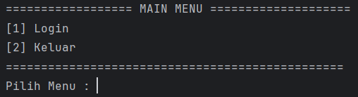
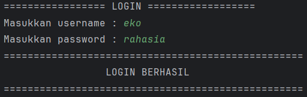
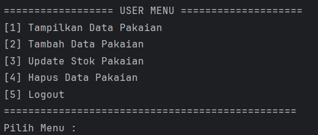
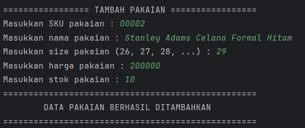
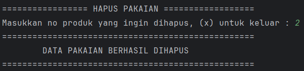

# Aplikasi Manajemen Data Pakaian

Aplikasi berbasis CLI (Command Line Interface) untuk mengelola data produk pakaian, dibangun menggunakan Java. Dilengkapi sistem autentikasi login dan mendukung operasi CRUD: tambah, tampilkan, update stok, dan hapus data pakaian. Menerapkan konsep **Inheritance** dengan `Clothes` sebagai parent class dan `Tops` serta `Bottoms` sebagai subclass.

---

## 📁 Struktur Proyek

```
├── assets/
└── src/
    └── io/github/mfthfzn/
        ├── Main.java
        ├── entity/
        │   ├── User.java
        │   ├── Clothes.java
        │   ├── Tops.java
        │   └── Bottoms.java
        ├── repository/
        │   ├── UserRepository.java
        │   └── ClothesRepository.java
        ├── service/
        │   ├── LoginService.java
        │   └── ClothesService.java
        ├── view/
        │   ├── LoginView.java
        │   └── ClothesView.java
        └── util/
            └── ScannerUtil.java
```

---

## Arsitektur

Proyek ini mengikuti pola **Layered Architecture** dengan 3 lapisan utama:

| Lapisan        | Kelas                                    | Tanggung Jawab                               |
|----------------|------------------------------------------|----------------------------------------------|
| **View**       | `LoginView`, `ClothesView`               | Menampilkan menu dan menerima input pengguna |
| **Service**    | `LoginService`, `ClothesService`         | Validasi data dan logika bisnis              |
| **Repository** | `UserRepository`, `ClothesRepository`   | Penyimpanan dan manipulasi data (in-memory)  |

---

## Konsep Inheritance

Proyek ini menerapkan **Hierarchical Inheritance**, di mana satu parent class memiliki lebih dari satu subclass:

```
Clothes          ← Parent Class
├── Tops         ← Subclass (ukuran: String — S, M, L, XL, XXL)
└── Bottoms      ← Subclass (ukuran: Integer — 26, 27, 28, ...)
```

`Clothes` menyimpan atribut umum (SKU, name, stock, price) yang diwarisi oleh `Tops` dan `Bottoms`. Masing-masing subclass menambahkan atribut `size` dengan tipe data yang berbeda sesuai karakteristiknya.

---

## Method Overriding

Method overriding diterapkan pada method `getLabel()` yang didefinisikan di `Clothes` dan di-override oleh masing-masing subclass untuk mengembalikan label kategori yang sesuai.

| Class      | Method       | Return Value     |
|------------|--------------|------------------|
| `Clothes`  | `getLabel()` | `"Pakaian"`      |
| `Tops`     | `getLabel()` | `"Pakaian Atas"` |
| `Bottoms`  | `getLabel()` | `"Pakaian Bawah"`|

Method ini dimanfaatkan di `ClothesService.showProducts()` untuk menampilkan kolom **Jenis** pada tabel produk secara otomatis sesuai tipe objeknya:

```java
// Clothes.java — definisi di parent
public String getLabel() {
    return "Pakaian";
}

// Tops.java — override di subclass
@Override
public String getLabel() {
    return "Pakaian Atas";
}

// Bottoms.java — override di subclass
@Override
public String getLabel() {
    return "Pakaian Bawah";
}
```

---

## Method Overloading

Method overloading diterapkan pada method `insert()` di `ClothesRepository` dan `addProduct()` di `ClothesService`. Kedua method memiliki nama yang sama namun menerima parameter dengan tipe yang berbeda (`Tops` atau `Bottoms`).

### `ClothesRepository.java`

| Method             | Parameter  | Keterangan               |
|--------------------|------------|--------------------------|
| `insert(Tops)`     | `Tops`     | Menyimpan produk Tops    |
| `insert(Bottoms)`  | `Bottoms`  | Menyimpan produk Bottoms |

```java
public void insert(Tops tops) {
    this.clothes.add(tops);
}

public void insert(Bottoms bottoms) {
    this.clothes.add(bottoms);
}
```

### `ClothesService.java`

| Method               | Parameter  | Keterangan                        |
|----------------------|------------|-----------------------------------|
| `addProduct(Tops)`   | `Tops`     | Validasi lalu simpan produk Tops  |
| `addProduct(Bottoms)`| `Bottoms`  | Validasi lalu simpan produk Bottoms|

```java
public void addProduct(Tops tops) {
    if (!tops.getSKU().isBlank() || ...) {
        clothesRepository.insert(tops);
    }
}

public void addProduct(Bottoms bottoms) {
    if (!bottoms.getSKU().isBlank() || ...) {
        clothesRepository.insert(bottoms);
    }
}
```

---

## Fitur

- **Login** — Autentikasi pengguna sebelum mengakses menu produk
- **Tampilkan Data Pakaian** — Menampilkan seluruh produk Tops dan Bottoms dalam satu tabel dengan kolom Jenis
- **Tambah Data Pakaian** — Menambahkan produk baru Tops atau Bottoms beserta atribut spesifiknya
- **Update Stok Pakaian** — Memperbarui jumlah stok produk berdasarkan nomor urut
- **Hapus Data Pakaian** — Menghapus produk berdasarkan nomor urut

---

## Penjelasan Kelas

### `User.java`
Model data yang merepresentasikan pengguna aplikasi.

| Field      | Tipe     | Keterangan    |
|------------|----------|---------------|
| `username` | `String` | Nama pengguna |
| `password` | `String` | Kata sandi    |

---

### `Clothes.java`
Parent class yang merepresentasikan atribut umum semua jenis pakaian.

| Field   | Tipe      | Keterangan       |
|---------|-----------|------------------|
| `SKU`   | `String`  | Kode unik produk |
| `name`  | `String`  | Nama pakaian     |
| `stock` | `Integer` | Jumlah stok      |
| `price` | `Integer` | Harga produk     |

| Method       | Keterangan                                       |
|--------------|--------------------------------------------------|
| `getLabel()` | Mengembalikan label kategori produk (`"Pakaian"`) |

---

### `Tops.java`
Subclass dari `Clothes` untuk produk pakaian atas. Menambahkan atribut `size` bertipe `String` dan meng-override `getLabel()`.

| Field  | Tipe     | Keterangan               |
|--------|----------|--------------------------|
| `size` | `String` | Ukuran (S, M, L, XL...)  |

| Method       | Keterangan                                              |
|--------------|---------------------------------------------------------|
| `getLabel()` | **Override** — mengembalikan `"Pakaian Atas"`           |

---

### `Bottoms.java`
Subclass dari `Clothes` untuk produk pakaian bawah. Menambahkan atribut `size` bertipe `Integer` dan meng-override `getLabel()`.

| Field  | Tipe      | Keterangan                   |
|--------|-----------|------------------------------|
| `size` | `Integer` | Ukuran pinggang (26, 28...)  |

| Method       | Keterangan                                              |
|--------------|---------------------------------------------------------|
| `getLabel()` | **Override** — mengembalikan `"Pakaian Bawah"`          |

---

### `UserRepository.java`
Mengelola data pengguna secara in-memory. Secara default menyediakan satu user awal.

| Method              | Keterangan                                          |
|---------------------|-----------------------------------------------------|
| `getUser(username)` | Mencari dan mengembalikan user berdasarkan username |

---

### `ClothesRepository.java`
Mengelola penyimpanan data seluruh pakaian (`Tops` dan `Bottoms`) dalam satu `ArrayList<Clothes>`.

| Method                 | Keterangan                                                        |
|------------------------|-------------------------------------------------------------------|
| `insert(Tops)`         | **Overload** — menyimpan produk Tops                              |
| `insert(Bottoms)`      | **Overload** — menyimpan produk Bottoms                           |
| `getAll()`             | Mengambil semua data pakaian                                      |
| `get(index)`           | Mengambil pakaian berdasarkan index                               |
| `edit(index, clothes)` | Memperbarui pakaian di index tertentu                             |
| `delete(index)`        | Menghapus pakaian di index tertentu                               |

---

### `LoginService.java`
Menangani logika autentikasi pengguna.

| Method                     | Keterangan                                 |
|----------------------------|--------------------------------------------|
| `auth(username, password)` | Memvalidasi username dan password pengguna |

---

### `ClothesService.java`
Menangani validasi dan logika bisnis untuk seluruh produk pakaian.

| Method                      | Keterangan                                                    |
|-----------------------------|---------------------------------------------------------------|
| `addProduct(Tops)`          | **Overload** — validasi lalu simpan Tops                      |
| `addProduct(Bottoms)`       | **Overload** — validasi lalu simpan Bottoms                   |
| `showProducts()`            | Tampilkan semua pakaian dalam satu tabel dengan kolom Jenis   |
| `checkProduct(index)`       | Validasi keberadaan pakaian di index                          |
| `editProduct(index, stock)` | Perbarui stok pakaian                                         |
| `removeProduct(index)`      | Hapus pakaian berdasarkan index                               |

---

### `LoginView.java`
Menangani tampilan autentikasi pengguna.

| Method        | Keterangan                            |
|---------------|---------------------------------------|
| `mainView()`  | Menampilkan menu utama (Login/Keluar) |
| `loginView()` | Form input username dan password      |

---

### `ClothesView.java`
Menangani seluruh interaksi pengelolaan produk pakaian melalui terminal.

| Method                   | Keterangan                                  |
|--------------------------|---------------------------------------------|
| `mainView()`             | Menampilkan menu user                       |
| `showClothesView()`      | Menampilkan tabel daftar semua pakaian      |
| `addClothesMainView()`   | Menu pilihan tambah Tops atau Bottoms       |
| `addClothesTopView()`    | Form tambah produk Tops baru                |
| `addClothesBottomView()` | Form tambah produk Bottoms baru             |
| `updateStockView()`      | Form update stok pakaian                    |
| `deleteClothesView()`    | Form hapus produk pakaian                   |

---

## Screenshots Tampilan

### Menu Utama


---

### Login


---

### Menu User


---

### 1. Tampilkan Data Pakaian


---

### 2. Tambah Data Pakaian




---

### 3. Update Stok Pakaian


---

### 4. Hapus Data Pakaian


---