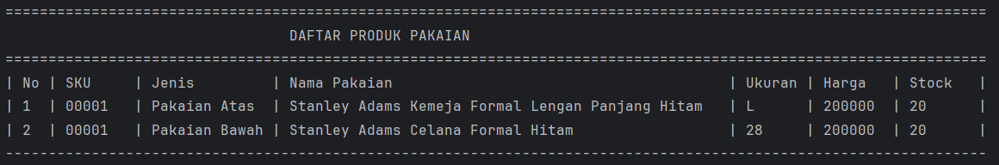
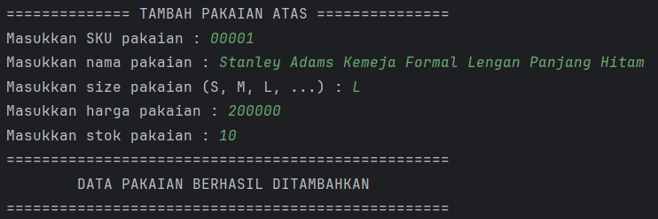
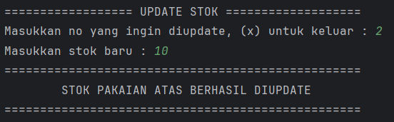

# Aplikasi Manajemen Data Pakaian

Aplikasi berbasis CLI (Command Line Interface) untuk mengelola data produk pakaian, dibangun menggunakan Java. Dilengkapi sistem autentikasi login dan mendukung operasi CRUD: tambah, tampilkan, update stok, dan hapus data pakaian.

---

## 📁 Struktur Proyek

```
├── assets/
└── src/
    └── io/github/mfthfzn/
        ├── Main.java
        ├── entity/
        │   ├── User.java
        │   ├── Clothes.java
        │   ├── Tops.java
        │   └── Bottoms.java
        ├── repository/
        │   ├── UserRepository.java
        │   ├── UserRepositoryImpl.java
        │   ├── ClothesRepository.java
        │   └── ClothesRepositoryImpl.java
        ├── service/
        │   ├── LoginService.java
        │   ├── LoginServiceImpl.java
        │   ├── ClothesService.java
        │   └── ClothesServiceImpl.java
        ├── view/
        │   ├── LoginView.java
        │   └── ClothesView.java
        └── util/
            └── ScannerUtil.java
```

---

## Arsitektur

Proyek ini mengikuti pola **Layered Architecture** dengan 3 lapisan utama:

| Lapisan        | Interface                                  | Implementasi                                       | Tanggung Jawab                               |
|----------------|--------------------------------------------|----------------------------------------------------|----------------------------------------------|
| **View**       | —                                          | `LoginView`, `ClothesView`                         | Menampilkan menu dan menerima input pengguna |
| **Service**    | `LoginService`, `ClothesService`           | `LoginServiceImpl`, `ClothesServiceImpl`           | Validasi data dan logika bisnis              |
| **Repository** | `UserRepository`, `ClothesRepository`     | `UserRepositoryImpl`, `ClothesRepositoryImpl`      | Penyimpanan dan manipulasi data (in-memory)  |

---

## Konsep Abstraction

Proyek ini menerapkan abstraction melalui dua cara:

### 1. Abstract Class
`Clothes` dideklarasikan sebagai `abstract class`, sehingga tidak dapat diinstansiasi langsung. Method `getLabel()` dideklarasikan sebagai `abstract`, sehingga setiap subclass **wajib** menyediakan implementasinya sendiri.

```java
public abstract class Clothes {
    // ...
    public abstract String getLabel();
}
```

### 2. Interface
Seluruh layer Repository dan Service menggunakan interface sebagai kontrak.

| Interface             | Implementasi              |
|-----------------------|---------------------------|
| `UserRepository`      | `UserRepositoryImpl`      |
| `ClothesRepository`   | `ClothesRepositoryImpl`   |
| `LoginService`        | `LoginServiceImpl`        |
| `ClothesService`      | `ClothesServiceImpl`      |

---

## Konsep Inheritance

Proyek ini menerapkan Hierarchical Inheritance, di mana satu parent class memiliki lebih dari satu subclass:

```
Clothes  (abstract)  ← Parent Class
├── Tops             ← Subclass (ukuran: String — S, M, L, XL, XXL)
└── Bottoms          ← Subclass (ukuran: Integer — 26, 27, 28, ...)
```

`Clothes` menyimpan atribut umum (SKU, name, stock, price) yang diwarisi oleh `Tops` dan `Bottoms`. Masing-masing subclass menambahkan atribut `size` dengan tipe data yang berbeda sesuai karakteristiknya.

---

## Method Overriding

Method overriding diterapkan pada method `getLabel()` yang dideklarasikan sebagai `abstract` di `Clothes` dan wajib di-override oleh masing-masing subclass.

| Class      | Method       | Return Value      |
|------------|--------------|-------------------|
| `Clothes`  | `getLabel()` | `abstract` (wajib diimplementasikan) |
| `Tops`     | `getLabel()` | `"Pakaian Atas"`  |
| `Bottoms`  | `getLabel()` | `"Pakaian Bawah"` |

Method ini dimanfaatkan di `ClothesServiceImpl.showProducts()` untuk menampilkan kolom **Jenis** pada tabel produk secara otomatis sesuai tipe objeknya:

```java
// Clothes.java — deklarasi abstract di parent
public abstract String getLabel();

// Tops.java — implementasi wajib di subclass
@Override
public String getLabel() {
    return "Pakaian Atas";
}

// Bottoms.java — implementasi wajib di subclass
@Override
public String getLabel() {
    return "Pakaian Bawah";
}
```

---

## Method Overloading

Method overloading diterapkan pada method `insert()` di `ClothesRepository` / `ClothesRepositoryImpl` dan `addProduct()` di `ClothesService` / `ClothesServiceImpl`. Kedua method memiliki nama yang sama namun menerima parameter dengan tipe yang berbeda (`Tops` atau `Bottoms`).

### `ClothesRepository.java` & `ClothesRepositoryImpl.java`

| Method            | Parameter | Keterangan               |
|-------------------|-----------|--------------------------|
| `insert(Tops)`    | `Tops`    | Menyimpan produk Tops    |
| `insert(Bottoms)` | `Bottoms` | Menyimpan produk Bottoms |

```java
void insert(Tops tops);
void insert(Bottoms bottoms);
```

### `ClothesService.java` & `ClothesServiceImpl.java`

| Method                | Parameter | Keterangan                          |
|-----------------------|-----------|-------------------------------------|
| `addProduct(Tops)`    | `Tops`    | Validasi lalu simpan produk Tops    |
| `addProduct(Bottoms)` | `Bottoms` | Validasi lalu simpan produk Bottoms |

```java
void addProduct(Tops tops);
void addProduct(Bottoms bottoms);
```

---

## Fitur

- **Login** — Autentikasi pengguna sebelum mengakses menu produk
- **Tampilkan Data Pakaian** — Menampilkan seluruh produk Tops dan Bottoms dalam satu tabel dengan kolom Jenis
- **Tambah Data Pakaian** — Menambahkan produk baru Tops atau Bottoms beserta atribut spesifiknya
- **Update Stok Pakaian** — Memperbarui jumlah stok produk berdasarkan nomor urut
- **Hapus Data Pakaian** — Menghapus produk berdasarkan nomor urut

---

## Penjelasan Kelas

### `User.java`
Model data yang merepresentasikan pengguna aplikasi.

| Field      | Tipe     | Keterangan    |
|------------|----------|---------------|
| `username` | `String` | Nama pengguna |
| `password` | `String` | Kata sandi    |

---

### `Clothes.java` *(Abstract Class)*
Abstract class yang merepresentasikan atribut umum semua jenis pakaian. Tidak dapat diinstansiasi langsung.

| Field   | Tipe      | Keterangan       |
|---------|-----------|------------------|
| `SKU`   | `String`  | Kode unik produk |
| `name`  | `String`  | Nama pakaian     |
| `stock` | `Integer` | Jumlah stok      |
| `price` | `Integer` | Harga produk     |

| Method       | Keterangan                                              |
|--------------|---------------------------------------------------------|
| `getLabel()` | **Abstract** — wajib diimplementasikan oleh subclass    |

---

### `Tops.java`
Subclass dari `Clothes` untuk produk pakaian atas. Menambahkan atribut `size` bertipe `String` dan mengimplementasikan `getLabel()`.

| Field  | Tipe     | Keterangan              |
|--------|----------|-------------------------|
| `size` | `String` | Ukuran (S, M, L, XL...) |

| Method       | Keterangan                                           |
|--------------|------------------------------------------------------|
| `getLabel()` | **Override** — mengembalikan `"Pakaian Atas"`        |

---

### `Bottoms.java`
Subclass dari `Clothes` untuk produk pakaian bawah. Menambahkan atribut `size` bertipe `Integer` dan mengimplementasikan `getLabel()`.

| Field  | Tipe      | Keterangan                  |
|--------|-----------|-----------------------------|
| `size` | `Integer` | Ukuran pinggang (26, 28...) |

| Method       | Keterangan                                           |
|--------------|------------------------------------------------------|
| `getLabel()` | **Override** — mengembalikan `"Pakaian Bawah"`       |

---

### `UserRepository.java` *(Interface)*
Kontrak untuk pengelolaan data pengguna.

| Method              | Keterangan                                          |
|---------------------|-----------------------------------------------------|
| `getUser(username)` | Mencari dan mengembalikan user berdasarkan username |

### `UserRepositoryImpl.java`
Implementasi dari `UserRepository`. Mengelola data pengguna secara in-memory dengan satu user awal bawaan.

---

### `ClothesRepository.java` *(Interface)*
Kontrak untuk penyimpanan dan manipulasi data pakaian.

| Method                 | Keterangan                                       |
|------------------------|--------------------------------------------------|
| `insert(Tops)`         | **Overload** — menyimpan produk Tops             |
| `insert(Bottoms)`      | **Overload** — menyimpan produk Bottoms          |
| `getAll()`             | Mengambil semua data pakaian                     |
| `get(index)`           | Mengambil pakaian berdasarkan index              |
| `edit(index, clothes)` | Memperbarui pakaian di index tertentu            |
| `delete(index)`        | Menghapus pakaian di index tertentu              |

### `ClothesRepositoryImpl.java`
Implementasi dari `ClothesRepository`. Menyimpan seluruh data pakaian dalam satu `ArrayList<Clothes>`.

---

### `LoginService.java` *(Interface)*
Kontrak untuk logika autentikasi pengguna.

| Method                     | Keterangan                                 |
|----------------------------|--------------------------------------------|
| `auth(username, password)` | Memvalidasi username dan password pengguna |

### `LoginServiceImpl.java`
Implementasi dari `LoginService`.

---

### `ClothesService.java` *(Interface)*
Kontrak untuk logika bisnis pengelolaan produk pakaian.

| Method                      | Keterangan                                                  |
|-----------------------------|-------------------------------------------------------------|
| `addProduct(Tops)`          | **Overload** — validasi lalu simpan Tops                    |
| `addProduct(Bottoms)`       | **Overload** — validasi lalu simpan Bottoms                 |
| `showProducts()`            | Tampilkan semua pakaian dalam satu tabel dengan kolom Jenis |
| `checkProduct(index)`       | Validasi keberadaan pakaian di index                        |
| `editProduct(index, stock)` | Perbarui stok pakaian                                       |
| `removeProduct(index)`      | Hapus pakaian berdasarkan index                             |

### `ClothesServiceImpl.java`
Implementasi dari `ClothesService`.

---

### `LoginView.java`
Menangani tampilan autentikasi pengguna.

| Method        | Keterangan                            |
|---------------|---------------------------------------|
| `mainView()`  | Menampilkan menu utama (Login/Keluar) |
| `loginView()` | Form input username dan password      |

---

### `ClothesView.java`
Menangani seluruh interaksi pengelolaan produk pakaian melalui terminal.

| Method                   | Keterangan                              |
|--------------------------|-----------------------------------------|
| `mainView()`             | Menampilkan menu user                   |
| `showClothesView()`      | Menampilkan tabel daftar semua pakaian  |
| `addClothesMainView()`   | Menu pilihan tambah Tops atau Bottoms   |
| `addClothesTopView()`    | Form tambah produk Tops baru            |
| `addClothesBottomView()` | Form tambah produk Bottoms baru         |
| `updateStockView()`      | Form update stok pakaian                |
| `deleteClothesView()`    | Form hapus produk pakaian               |

---

## Screenshots Tampilan

### Menu Utama


---

### Login


---

### Menu User


---

### 1. Tampilkan Data Pakaian


---

### 2. Tambah Data Pakaian




---

### 3. Update Stok Pakaian


---

### 4. Hapus Data Pakaian


---
